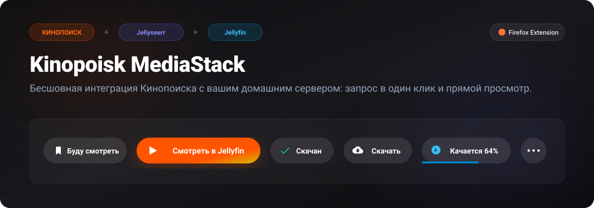
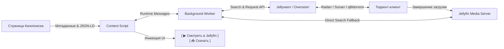
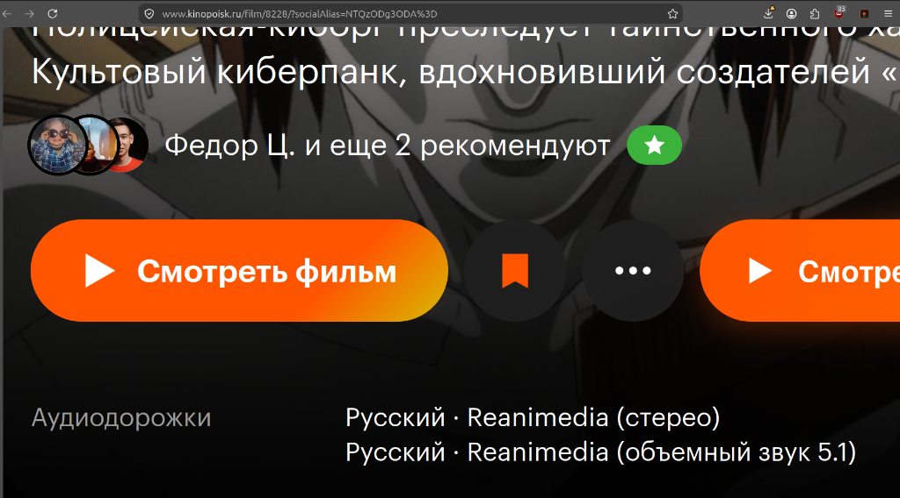
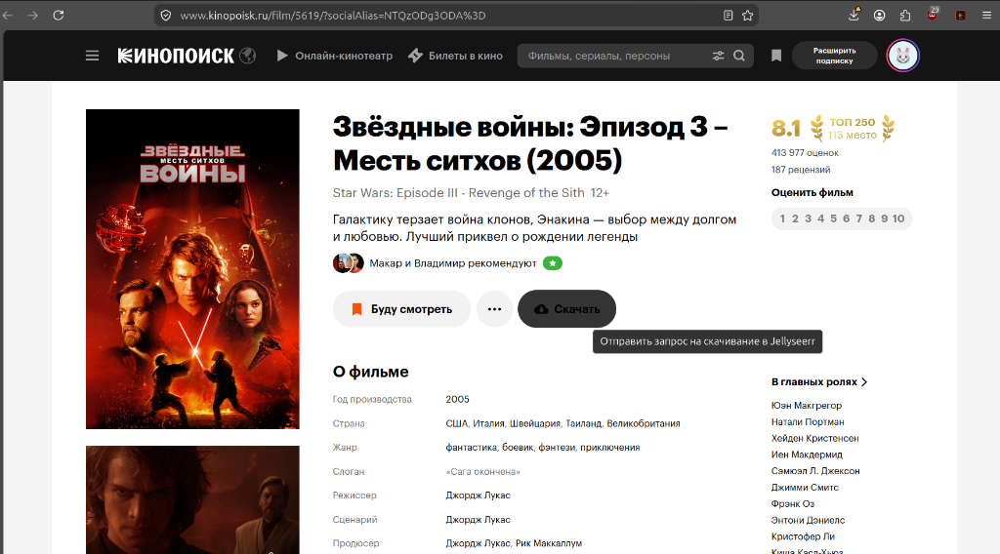
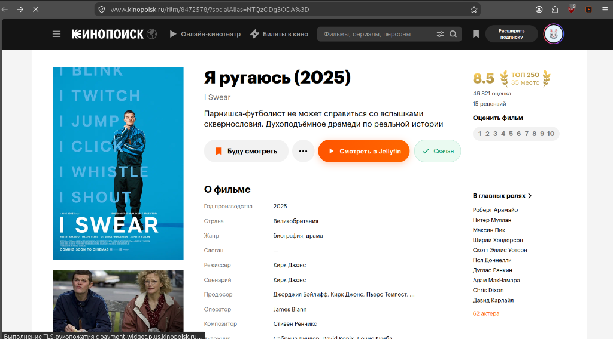
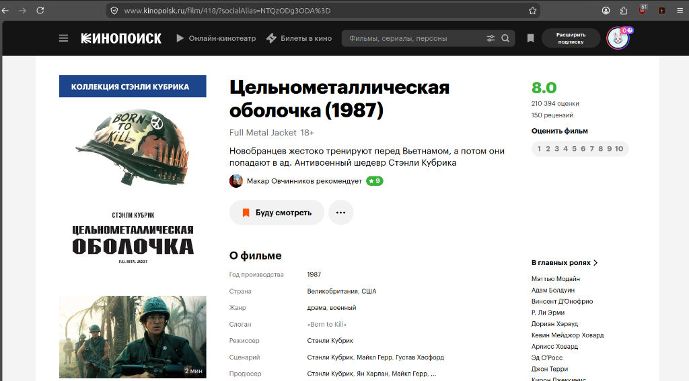

<p align="center">
  
</p>

<p align="center">
  <a href="https://github.com"></a>
  <a href="https://github.com"></a>
  <a href="https://github.com"></a>
  <a href="https://github.com"></a>
  <a href="LICENSE"></a>
  <a href="https://github.com"></a>
</p>

<p align="center">
  <b>Браузерное расширение для Mozilla Firefox, которое бесшовно связывает страницы фильмов и сериалов Кинопоиска с вашим домашним медиасервером.</b>
</p>

<p align="center">
  <i>Запрашивайте скачивание в Jellyseerr в один клик, следите за процентом загрузки торрента в реальном времени и открывайте готовые фильмы прямо в плеере Jellyfin.</i>
</p>

---

## 🌟 Основные возможности

- 🎯 **100% Нативный дизайн Кинопоиска (Pixel-Perfect)**
  - Автоматическая адаптация под **светлую** (белый фон) и **тёмную** (постерный блок Кинопоиск Плюс) темы.
  - Точные фирменные пропорции (`высота 52px`, канонический pill-радиус `52px`, паддинги `0 26px 0 22px`).
  - Оригинальный двухцветный градиент кнопки воспроизведения `linear-gradient(135deg, #f50 69.93%, #d6bb00 100%)`.
  - Векторный треугольник Play `24×24 px` с каноническими острыми углами, извлеченный напрямую из ассетов Кинопоиска.
  - Серая кнопка «Скачать» полностью повторяет цвет и поведение нативных кнопок Кинопоиска («Буду смотреть», «…»).

- ⚡ **Интерактивные статусы и управление**
  - `[ 📥 Скачать ]` — фильм отсутствует в домашней коллекции. Клик отправляет запрос в Jellyseerr.
  - `[ 🕒 Запрошен ]` — медиафайл ожидает одобрения или постановки в очередь.
  - `[ ⏬ Качается 64% ]` — отображение реального процента скачивания торрент-клиентом с прогресс-баром.
  - `[ ✓ Скачан ]` — подтверждение наличия тайтла в библиотеке.
  - `[ ▶ Смотреть в Jellyfin ]` — яркая кнопка прямого перехода в карточку фильма/сериала веб-плеера Jellyfin.

- 🔄 **Поддержка SPA-навигации**
  - Отслеживает переходы между страницами Кинопоиска (HTML5 History API + MutationObserver) без перезагрузки вкладки.

- ⚙️ **Универсальность и простота настройки**
  - Подходит для любого пользователя с сервером Jellyseerr / Overseerr и Jellyfin.
  - Поддержка доменов (`https://requests.example.com`) и локальных IP-адресов (`http://192.168.1.100:5055`).
  - Встроенное тестирование подключения с проверкой сетевой задержки и версии серверов.

- 🛡️ **Безопасность и автономность**
  - Manifest V3, чистый Vanilla JavaScript, **ноль внешних зависимостей**.
  - Фоновый воркер обходит CORS и политику безопасности контента (CSP) Кинопоиска.
  - Никакой телеметрии и сторонних серверов — данные передаются исключительно между вашим браузером и вашим сервером.

---

## 🏗️ Архитектура и схема работы



---

## 🚀 Установка

### Вариант 1: Установка из GitHub Releases (Рекомендуемый)

1. Перейдите в раздел [**Releases**](../../releases) репозитория.
2. Скачайте свежий файл **`kinopoisk-mediastack.xpi`** (или `.zip`).
3. В **Firefox Developer Edition** или **Nightly**:
   - Перетащите файл `.xpi` в окно браузера и подтвердите установку.
   *(Для обычной версии Firefox: в `about:config` установите `xpinstall.signatures.required` в `false`)*.

### Вариант 2: Временная загрузка через `about:debugging` (Для всех версий Firefox)

1. Скачайте и распакуйте репозиторий (или скачайте `dist/kinopoisk-mediastack.zip`).
2. В браузере Firefox откройте служебную вкладку:
   ```text
   about:debugging#/runtime/this-firefox
   ```
3. Нажмите **«Загрузить временное дополнение…»** (*Load Temporary Add-on…*).
4. Выберите файл **`manifest.json`** из распакованной папки.
5. Расширение мгновенно активируется в браузере.

---

## ⚙️ Настройка расширения

После установки нажмите правой кнопкой мыши по иконке расширения в панели инструментов и выберите **«Настройки»** (или откройте настройки через попап):

1. **Jellyseerr / Overseerr**:
   - **URL сервера**: полный адрес, например `https://requests.example.com` или `http://192.168.1.100:5055`.
   - **API Ключ**: скопируйте в веб-интерфейсе: *Settings (Настройки) → General (Общие) → API Key*.
   - Нажмите **«Проверить Jellyseerr»** — отобразится зелёный бейдж с версией сервера.

2. **Jellyfin**:
   - **URL сервера**: адрес веб-интерфейса, например `https://jellyfin.example.com` или `http://192.168.1.100:8096`.
   - **API Ключ (опционально)**: ключ из *Панель управления → Ключи API*.
   - Нажмите **«Проверить Jellyfin»**.

3. Нажмите кнопку **«Сохранить настройки»**.

Готово! Откройте любую страницу фильма или сериала на [Кинопоиске](https://www.kinopoisk.ru) — кнопки статуса появятся автоматически.

---

## 📸 Скриншоты

<table align="center">
  <tr>
    <td align="center" width="50%">
      <b>Тёмная тема: Фильм готов к просмотру</b><br>
      <i>(Канонический треугольник Play и бейдж «Скачан»)</i><br><br>
      
    </td>
    <td align="center" width="50%">
      <b>Светлая тема: Фильм не скачан</b><br>
      <i>(Нативная серая кнопка «Скачать»)</i><br><br>
      
    </td>
  </tr>
  <tr>
    <td align="center" width="50%">
      <b>Панель настроек расширения</b><br>
      <i>(Тестирование подключения к серверам)</i><br><br>
      
    </td>
    <td align="center" width="50%">
      <b>Всплывающее меню (Popup)</b><br>
      <i>(Быстрый просмотр статуса текущей вкладки)</i><br><br>
      
    </td>
  </tr>
</table>

---

## 🛠️ Разработка и сборка

Репозиторий не требует сборщиков (Webpack/Vite) — код написан на чистом современном JavaScript (ES6+), что обеспечивает максимальное быстродействие и прозрачность.

### Запуск тестов
```bash
npm test
```
Тест валидирует структуру `manifest.json`, наличие всех размеров иконок, mock-запросы к API и корректность расчета процентов загрузки.

### Сборка пакетов
```bash
# Создание zip-архива для публикации:
npm run package

# Создание xpi-пакета для Firefox:
npm run build:xpi
```
Собранные файлы сохраняются в каталоге `dist/`.

---

## 📂 Структура проекта

```text
kinopoisk-media-extension/
├── manifest.json              # Манифест Firefox WebExtension (MV3)
├── background/
│   ├── background.js          # Фоновый координатор и обработчик сообщений
│   ├── jellyseerr-api.js      # Взаимодействие с REST API Jellyseerr
│   └── jellyfin-api.js        # Формирование ссылок и fallback-поиск Jellyfin
├── content/
│   ├── content.js             # Парсинг страницы, SPA-роутинг и инжекция виджета
│   └── content.css            # Точные стили и цвета UI-кита Кинопоиска
├── options/                   # Страница настроек сервера и API-ключей
├── popup/                     # Быстрое меню статуса в панели браузера
├── icons/                     # Набор векторных и растровых иконок (16..128px)
├── assets/                    # Графика, баннеры и скриншоты для GitHub
├── test/
│   └── run-tests.js           # Автоматический тестовый запуск
├── .github/workflows/
│   ├── ci.yml                 # CI валидация при пушах и PR
│   └── release.yml            # Автоматическая сборка релизов по тегам v*
├── package.json               # Скрипты упаковки и метаданные
└── LICENSE                    # Лицензия MIT
```

---

## 🤝 Вклад в проект (Contributing)

Пулл-реквесты и предложения приветствуются! Если вы нашли ошибку или хотите предложить улучшение (например, поддержку других трекеров или медиасерверов):
1. Сделайте Fork репозитория.
2. Создайте тематическую ветку (`git checkout -b feature/awesome-feature`).
3. Закоммитьте изменения (`git commit -m 'feat: add awesome feature'`).
4. Отправьте ветку (`git push origin feature/awesome-feature`).
5. Откройте Pull Request.

---

## 📄 Лицензия

Проект распространяется под свободной лицензией **MIT**. Подробности в файле [LICENSE](LICENSE).
